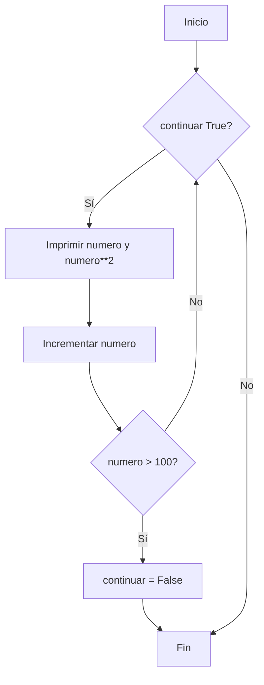
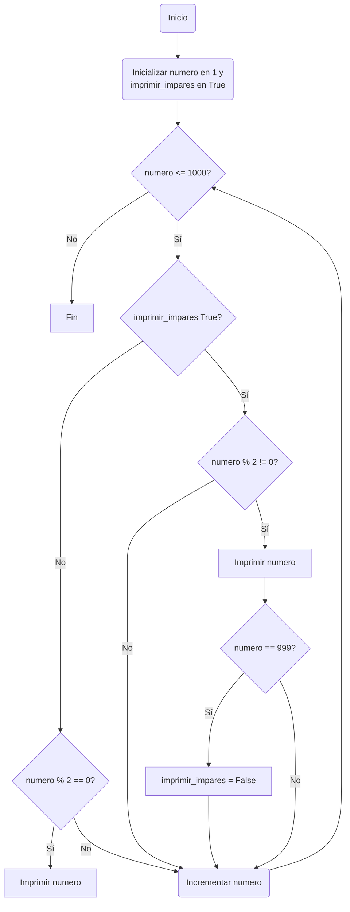
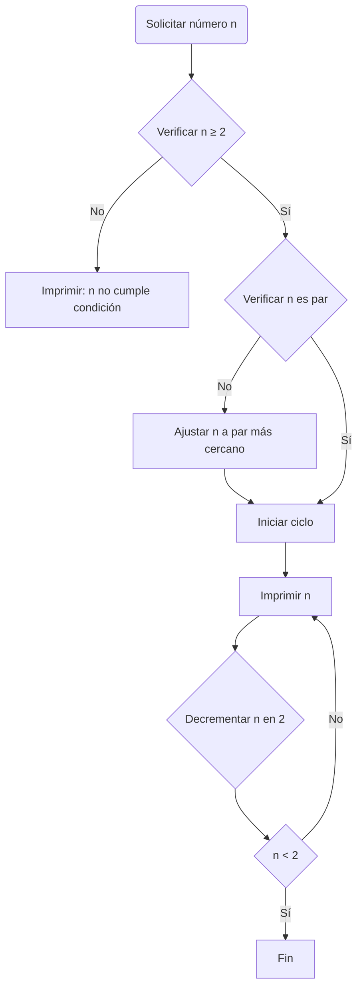

# Reto_7_Michael_Mora

Desarrollo del reto 7, según lo aprendido en clase [Clase 10](http://https://github.com/fegonzalez7/pdc_unal_clase10 "Clase 10"), con las siguientes recomendaciones:

Desarrolle de manera individual la mayoría de ejercicios en clase. Para cada punto cree un programa individual asimismo cree un notebook con la solución a todos los problemas. Al finalizar suba todo a un repo y subalo al canal reto_7 en slack, los tres primeros puntos deben incluir diagrama de flujo.

**Nota:** Todo el código de aquí en adelante debe ir debidamente documentado.
_______________________________
## **Punto 1**

**Instrucciones:** Imprimir un listado con los números del 1 al 100 cada uno con su respectivo cuadrado.

```python
# Inicializamos una bandera y un contador
continuar = True
numero = 1

# Usamos un ciclo while que se ejecuta mientras la bandera sea True
while continuar:
    # Imprime el número y su cuadrado
    print(f"{numero} - {numero**2}")
    
    # Incrementamos el número para la próxima iteración
    numero += 1
    
    # Verificamos si debemos detener el ciclo
    if numero > 100:
        continuar = False

```

Este código usa una bandera llamada continuar para controlar el flujo del ciclo `while`. Comienza con el número 1 y en cada iteración del ciclo, imprime el número y su cuadrado. Luego, incrementa el número por 1. Si el número excede 100, cambia la bandera `continuar` a `False`, lo que hace que el ciclo `while` termine.

### Diagrama de flujo 1:

_______________________________
## **Punto 2**
**Instrucciones:** Imprimir un listado con los números impares desde 1 hasta 999 y seguidamente otro listado con los números pares desde 2 hasta 1000.

```python
# Inicializamos las variables
numero = 1
imprimir_impares = True  # Bandera para controlar cuándo imprimir números impares

# Usamos un ciclo while que se ejecuta mientras el número sea menor o igual a 1000
while numero <= 1000:
    if imprimir_impares:
        # Imprime el número si es impar
        if numero % 2 != 0:
            print(numero)
        # Cambia la bandera para empezar a imprimir pares cuando llegamos a 999
        if numero == 999:
            imprimir_impares = False
    else:
        # Imprime el número si es par
        if numero % 2 == 0:
            print(numero)
    
    # Incrementamos el número para la próxima iteración
    numero += 1

```
Este código utiliza un ciclo `while` que se ejecuta mientras el número actual sea menor o igual a 1000. Utiliza una bandera llamada `imprimir_impares` para determinar si debe imprimir números impares o pares. Inicialmente, imprime números impares (ya que la bandera está establecida en True). Una vez que el número alcanza 999 y se imprime, cambia la bandera para empezar a imprimir números pares (estableciendo `imprimir_impares` en False). El ciclo continúa incrementando el número y verificando si es par o impar según el estado de la bandera, imprimiendo los números correspondientes hasta que se completa el ciclo.

### Diagrama de flujo 2:

_______________________________
## **Punto 3**
**Instrucciones:** Imprimir los números pares en forma descendente hasta 2 que son menores o iguales a un número natural n ≥ 2 dado
```python
# Solicitamos al usuario que ingrese un número natural n.
n = int(input("Ingrese un número natural n (n ≥ 2): "))

# Verificamos si n cumple con la condición de ser mayor o igual a 2.
if n < 2:
    print("El número ingresado no cumple con la condición (n ≥ 2).")
else:
    # Ajustamos n al número par más cercano menor o igual a n.
    if n % 2 != 0:
        n -= 1
    
    # Utilizamos una bandera para controlar el ciclo while.
    continuar = True

    # Iniciamos el ciclo while.
    while continuar:
        print(n)
        
        # Decrementamos n en 2 para obtener el próximo número par descendente.
        n -= 2
        
        # Si n es menor que 2, cambiamos la bandera para detener el ciclo.
        if n < 2:
            continuar = False
```
Este código primero verifica que el valor ingresado por el usuario cumpla con la condición de ser mayor o igual a 2. Si es así, ajusta el número al par más cercano por debajo (en caso de que el número ingresado sea impar) y luego entra en un ciclo `while` controlado por una bandera llamada `continuar`. Dentro del ciclo, imprime el valor actual de n y luego decrementa n en 2 para pasar al siguiente número par. Si  n se convierte en un valor menor que 2, la bandera `continuar` cambia a `False`, lo que detiene el ciclo.



_______________________________
## **Punto 4**
**Instrucciones:** En 2022 el país A tendrá una población de 25 millones de habitantes y el país B de 18.9 millones. Las tasas de crecimiento anual de la población serán de 2% y 3% respectivamente. Desarrollar un algoritmo para informar en que año la población del país B superará a la de A.


```python
# Inicialización de variables
poblacion_a = 25e6  # 25 millones de habitantes
poblacion_b = 18.9e6  # 18.9 millones de habitantes
tasa_crecimiento_a = 0.02  # Tasa de crecimiento anual del 2%
tasa_crecimiento_b = 0.03  # Tasa de crecimiento anual del 3%
ano_actual = 2022  # Año de inicio

# Ciclo while para calcular el año en que la población de B supera a la de A
while poblacion_b <= poblacion_a:
    # Actualización de poblaciones según las tasas de crecimiento
    poblacion_a += poblacion_a * tasa_crecimiento_a
    poblacion_b += poblacion_b * tasa_crecimiento_b
    # Incremento del año
    ano_actual += 1

# Imprimir el año en que la población de B supera a la de A
print(f"En el año {ano_actual}, la población del país B superará a la de A.")
```

Este algoritmo comienza con las poblaciones iniciales de ambos países en 2022 y aplica las tasas de crecimiento anual para cada país. El ciclo `while` se repite cada año, actualizando las poblaciones de ambos países según sus respectivas tasas de crecimiento, hasta que la condición (`poblacion_b <= poblacion_a`) ya no se cumple, es decir, la población de B supera a la de A. Cuando esto sucede, el ciclo termina y se imprime el año actual, indicando el momento en que la población de B supera a la de A.
_______________________________
## **Punto 5**
**Instrucciones:** Imprimir el factorial de un número natural n dado.

```python
# Solicitar al usuario que ingrese un número natural n
n = int(input("Ingrese un número natural n para calcular su factorial: "))

# Inicializar la variable factorial
factorial = 1

# Verificar si el número es negativo, cero o positivo
if n < 0:
    print("El factorial no se define para números negativos.")
else:
    # Calcular el factorial usando un ciclo while
    numero_actual = n
    while numero_actual > 1:
        factorial *= numero_actual
        numero_actual -= 1

    # Imprimir el resultado
    print(f"El factorial de {n} es {factorial}.")
```

Este código primero verifica si el número ingresado es negativo, en cuyo caso informa al usuario que el factorial no se define para números negativos. Si el número es cero o positivo, utiliza un ciclo `while` para calcular el factorial multiplicando los números desde n hasta 1. La variable factorial acumula el producto de estos números, y `numero_actual` se decrementa en cada iteración hasta que alcanza 1, momento en el cual se completa el cálculo del factorial. Finalmente, se imprime el resultado.
_______________________________
## **Punto 6**
**Instrucciones:** Implementar un algoritmo que permita adivinar un número dado de 1 a 100, preguntando en cada caso si el número es mayor, menor o igual.
```python
# Inicializar los límites inferior y superior del rango de números.
limite_inferior = 1
limite_superior = 100

# Iniciar el ciclo de adivinación.
while True:
    # Calcular el punto medio como nuestro próximo número a adivinar.
    intento = (limite_inferior + limite_superior) // 2
    
    # Preguntar al usuario sobre el intento.
    respuesta = input(f"¿El número es {intento}? (responde 'mayor', 'menor', 'igual'): ").lower()
    
    # Ajustar el rango basado en la respuesta.
    if respuesta == "mayor":
        limite_inferior = intento + 1
    elif respuesta == "menor":
        limite_superior = intento - 1
    elif respuesta == "igual":
        print(f"¡Adiviné! Tu número es {intento}.")
        break
    else:
        print("Respuesta no válida. Por favor, responde 'mayor', 'menor' o 'igual'.")
    
    # Si se cruzan los límites, significa que ha habido un error en las respuestas dadas.
    if limite_inferior > limite_superior:
        print("Parece que ha habido un error en las respuestas. No se puede adivinar bajo estas condiciones.")
        break

```
Este algoritmo empieza con un rango de 1 a 100 y calcula el punto medio de este rango como el número a adivinar. Según la respuesta del usuario (mayor, menor, igual), el algoritmo ajusta el rango de búsqueda y calcula un nuevo punto medio para el próximo intento. Este proceso se repite hasta que el usuario indica que el número ha sido adivinado correctamente (igual), o hasta que las respuestas no permiten continuar la lógica de búsqueda binaria (por ejemplo, si el límite inferior supera al límite superior, lo que indicaría una inconsistencia en las respuestas).
_______________________________
## **Punto 7**
**Instrucciones:** Implementar un programa que ingrese un número de 2 a 50 y muestre sus divisores.
```python
# Solicitar al usuario que ingrese un número entre 2 y 50
numero = int(input("Ingrese un número entre 2 y 50: "))

# Verificar que el número esté en el rango permitido
if numero < 2 or numero > 50:
    print("El número ingresado no está en el rango permitido.")
else:
    print(f"Divisores de {numero}:")
    # Utilizar un ciclo for para encontrar los divisores del número
    for divisor in range(1, numero + 1):
        # Si el número es divisible por divisor, imprimirlo
        if numero % divisor == 0:
            print(divisor)
```
este código primero verifica si el número ingresado está dentro del rango permitido (2 a 50). Si es así, procede a iterar sobre un rango de posibles divisores (desde 1 hasta el número ingresado) y utiliza el operador módulo (`%`) para verificar si el divisor actual es un `divisor` del número ingresado (es decir, si el resto de la división es 0). Si se cumple esta condición, imprime el `divisor`.
_______________________________
## **Punto 8**
**Instrucciones:** Implementar el algoritmo que muestre los números primos del 1 al 100. Nota: use funciones
```python
# Definir la función que verifica si un número es primo
def es_primo(numero):
    if numero < 2:
        return False
    for divisor in range(2, int(numero**0.5) + 1):
        if numero % divisor == 0:
            return False
    return True

# Inicializar el número de inicio
numero = 1

# Utilizar un ciclo while para iterar a través de los números del 1 al 100
while numero <= 100:
    if es_primo(numero):
        print(numero)
    numero += 1
```

La función `es_primo` recibe un número como argumento y retorna `True` si el número es primo y `False` en caso contrario. Para optimizar la función, solo se verifica la divisibilidad del número por los posibles divisores hasta la raíz cuadrada del número, ya que si un número tiene un divisor mayor que su raíz cuadrada, necesariamente tendría otro divisor menor que ella, y por lo tanto ya habría sido detectado como no primo.
Después de definir la función, el código utiliza un bucle `for` para iterar sobre los números del 1 al 100, llamando a la función `es_primo` para cada número. Si la función retorna `True`, el número se imprime, identificándolo como un número primo.
_______________________________
**FIN DEL RETO**
