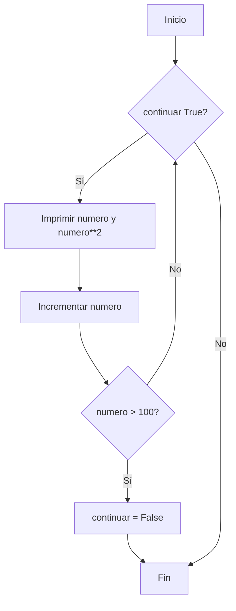
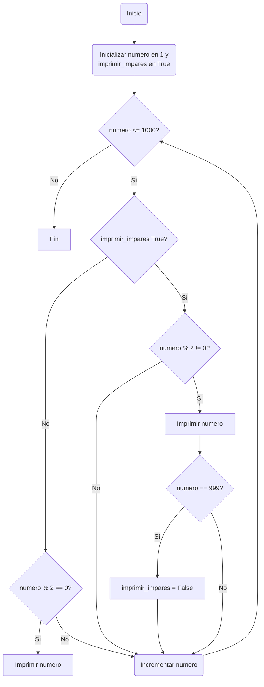

# Reto_7_Michael_Mora

Desarrollo del reto 7, según lo aprendido en clase [Clase 10](http://https://github.com/fegonzalez7/pdc_unal_clase10 "Clase 10"), con las siguientes recomendaciones:

Desarrolle de manera individual la mayoría de ejercicios en clase. Para cada punto cree un programa individual asimismo cree un notebook con la solución a todos los problemas. Al finalizar suba todo a un repo y subalo al canal reto_7 en slack, los tres primeros puntos deben incluir diagrama de flujo.

**Nota:** Todo el código de aquí en adelante debe ir debidamente documentado.
_______________________________
## **Punto 1**

**Instrucciones:** Imprimir un listado con los números del 1 al 100 cada uno con su respectivo cuadrado.

```python
# Inicializamos una bandera y un contador
continuar = True
numero = 1

# Usamos un ciclo while que se ejecuta mientras la bandera sea True
while continuar:
    # Imprime el número y su cuadrado
    print(f"{numero} - {numero**2}")
    
    # Incrementamos el número para la próxima iteración
    numero += 1
    
    # Verificamos si debemos detener el ciclo
    if numero > 100:
        continuar = False

```

Este código usa una bandera llamada continuar para controlar el flujo del ciclo `while`. Comienza con el número 1 y en cada iteración del ciclo, imprime el número y su cuadrado. Luego, incrementa el número por 1. Si el número excede 100, cambia la bandera `continuar` a `False`, lo que hace que el ciclo `while` termine.

### Diagrama de flujo 1:

_______________________________
## **Punto 2**
**Instrucciones:** Imprimir un listado con los números impares desde 1 hasta 999 y seguidamente otro listado con los números pares desde 2 hasta 1000.

```python
# Inicializamos las variables
numero = 1
imprimir_impares = True  # Bandera para controlar cuándo imprimir números impares

# Usamos un ciclo while que se ejecuta mientras el número sea menor o igual a 1000
while numero <= 1000:
    if imprimir_impares:
        # Imprime el número si es impar
        if numero % 2 != 0:
            print(numero)
        # Cambia la bandera para empezar a imprimir pares cuando llegamos a 999
        if numero == 999:
            imprimir_impares = False
    else:
        # Imprime el número si es par
        if numero % 2 == 0:
            print(numero)
    
    # Incrementamos el número para la próxima iteración
    numero += 1

```
Este código utiliza un ciclo `while` que se ejecuta mientras el número actual sea menor o igual a 1000. Utiliza una bandera llamada `imprimir_impares` para determinar si debe imprimir números impares o pares. Inicialmente, imprime números impares (ya que la bandera está establecida en True). Una vez que el número alcanza 999 y se imprime, cambia la bandera para empezar a imprimir números pares (estableciendo `imprimir_impares` en False). El ciclo continúa incrementando el número y verificando si es par o impar según el estado de la bandera, imprimiendo los números correspondientes hasta que se completa el ciclo.

### Diagrama de flujo 2:

_______________________________
## **Punto 3**
**Instrucciones:** Imprimir los números pares en forma descendente hasta 2 que son menores o iguales a un número natural n ≥ 2 dado
```python
# Solicitamos al usuario que ingrese un número natural n.
n = int(input("Ingrese un número natural n (n ≥ 2): "))

# Verificamos si n cumple con la condición de ser mayor o igual a 2.
if n < 2:
    print("El número ingresado no cumple con la condición (n ≥ 2).")
else:
    # Ajustamos n al número par más cercano menor o igual a n.
    if n % 2 != 0:
        n -= 1
    
    # Utilizamos una bandera para controlar el ciclo while.
    continuar = True

    # Iniciamos el ciclo while.
    while continuar:
        print(n)
        
        # Decrementamos n en 2 para obtener el próximo número par descendente.
        n -= 2
        
        # Si n es menor que 2, cambiamos la bandera para detener el ciclo.
        if n < 2:
            continuar = False
```
